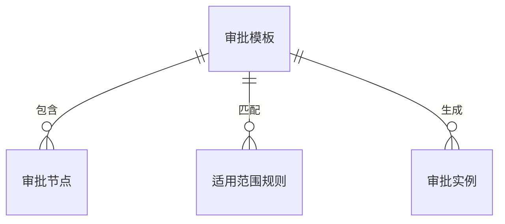
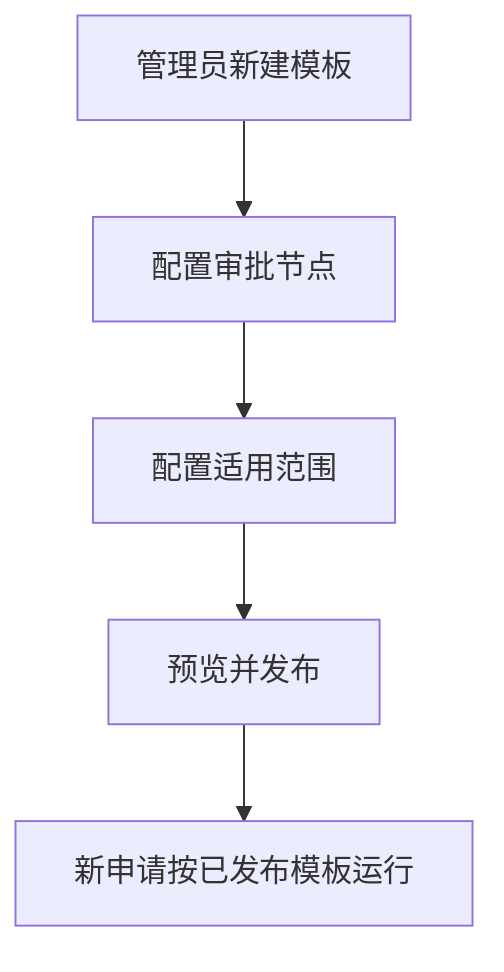

# 示例：审批流 / 配置流类 PRD（Few-shot 示例）

> 适用目的：约束 `prd-writer-b2b` Skill 在流程配置类需求中的写法。
> 需求类型：ToB / 中后台 / 审批工作流 / 配置能力

## 1. 版本信息

| 版本号 | 更新时间 | 作者 | 变更说明 | 状态 |
|---|---|---|---|---|
| V0.1 | 2026-04-02 | ChatGPT | 初稿创建，补齐审批流配置方案 | 草稿 |

---

## 2. 需求背景

当前采购申请流程采用固定审批链路，不同客户、不同部门和不同金额区间的审批要求只能依赖人工沟通或研发调整。随着组织规模扩大，这种方式已经难以支撑实际交付：一方面客户经常提出新的审批路径要求，另一方面每次变更都需要重新排期，导致实施效率和配置可控性都比较差。

从业务上看，审批流变化主要集中在三个方面：不同业务类型需要走不同链路，不同金额区间需要加签不同角色，不同部门对审批人来源的规则也不一致。如果继续依赖固定逻辑，后续扩展到报销、合同、用印等场景时，重复建设成本会越来越高。

因此，本期建议先建设一套基础审批流配置能力，优先完成“模板可维护、节点可配置、适用范围可判断、发布后可控生效”这四个闭环。首期不追求复杂流程引擎能力，而是先满足典型串行审批场景。

---

## 3. Roadmap

| 模块 | 模块说明 | 优先级 | 原因 |
|---|---|---|---|
| 流程模板管理 | 维护审批模板的基础信息和状态 | P0 | 是所有配置的承载基础 |
| 审批节点配置 | 配置审批顺序和审批人来源 | P0 | 决定流程能否按预期运行 |
| 适用范围配置 | 判断什么申请匹配什么模板 | P0 | 决定运行时如何选中模板 |
| 预览与发布 | 控制模板何时生效及如何预览 | P0 | 关系到变更风险控制 |
| 模板复制与变更记录 | 提高复用效率和排查效率 | P1 | 有助于运维治理，但非首期闭环 |
| 高级流程能力 | 如会签、并行、催办等 | P2 | 复杂度较高，后续再评估 |

---

## 4. 需求详情

### 4.1 E-R 实体关系图（如适用）

本需求涉及“审批模板”“审批节点”“适用范围规则”“审批实例”等业务对象，建议补充关系图帮助理解。

---

### 4.2 功能模块一：流程模板管理

本模块面向企业管理员，目标是让审批配置从“每次找研发改”转为“管理员在后台可维护”。系统需要支持模板列表、新建、编辑、复制、启停和发布等基础能力，使审批配置有清晰入口，也有明确状态。

在使用方式上，模板列表建议展示模板名称、业务类型、状态、版本号和更新时间。新建时先录入基础信息，再进入节点和范围配置。对于已发布模板，本期不建议直接原地修改，而是通过复制生成新版本后再发布，降低线上流程被误改的风险。

本模块的关键规则包括：同一业务类型下模板名称应避免重复；已发布模板原则上不可直接覆盖；停用模板不再参与新申请匹配，但已在途流程保持原有运行结果不变。这样可以兼顾配置灵活性和线上稳定性。

---

### 4.3 功能模块二：审批节点配置

本模块目标是让管理员明确一条审批链路由哪些节点组成，以及每一步由谁处理。系统需要支持按顺序配置审批节点，并为每个节点设置审批人来源，例如直属负责人、部门负责人、固定角色或指定成员。首期建议聚焦串行节点，不引入复杂分支和并行逻辑。

在交互上，节点配置建议采用列表式或分步式编辑，让管理员可以直观看到审批顺序。每个节点除名称外，还应能说明审批人如何确定。若当前组织架构数据并不完整，应在待确认项中说明哪些来源规则本期无法稳定支撑。

本模块的关键规则包括：节点顺序需要明确且可调整；同一模板至少应有一个审批节点；若某个节点因组织数据缺失无法定位审批人，系统需要有明确提示，避免管理员误以为配置已生效。

#### 流程说明（如需要）

---

### 4.4 功能模块三：适用范围配置与发布生效

本模块目标是让系统能够判断不同申请应该走哪套审批模板，同时控制模板何时生效。系统需要支持按业务类型、金额区间、部门等条件配置模板适用范围，并在发布前提供预览能力，帮助管理员确认流程结果。

在使用方式上，适用范围建议与模板配置保持在同一编辑链路内，避免管理员跨多个页面配置。发布前，系统应支持预览模板的完整审批链路，便于管理员判断是否符合预期。发布后，只有新发起的申请使用新模板，已在途申请仍按原模板继续执行。

本模块的关键规则包括：同一申请在同一时刻只能匹配一套生效模板；若多个模板命中同一条件，需要有明确优先级或冲突提示；已发布模板再次调整时，应通过新版本管理，避免直接影响存量流程。

---

## 5. 待确认项
- 当前组织架构数据是否足以支持“直属负责人”“部门负责人”等审批人来源，待确认。
- 多个模板命中同一申请条件时，优先级规则如何确定，待确认。
- 历史审批记录是否需要展示所命中的模板版本，待确认。
