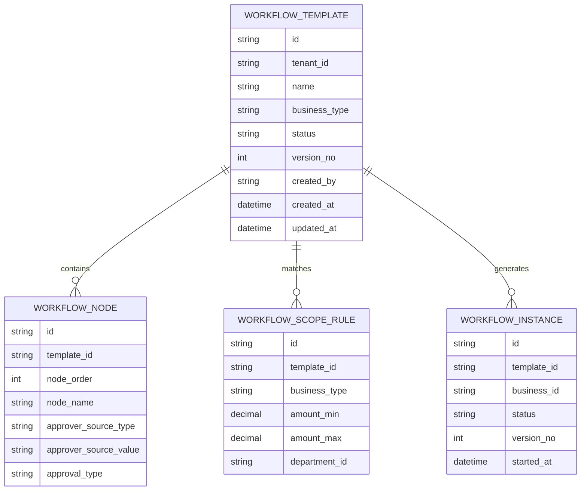
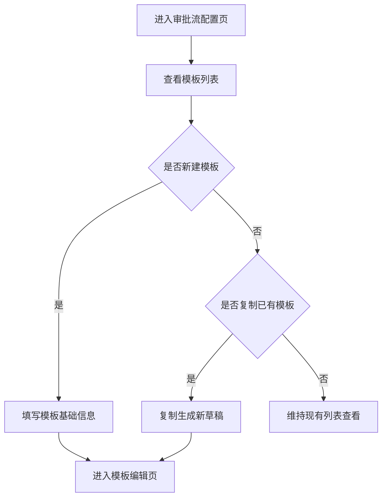
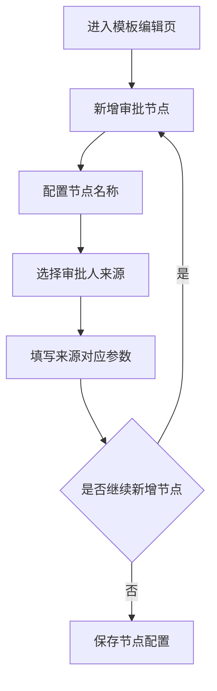
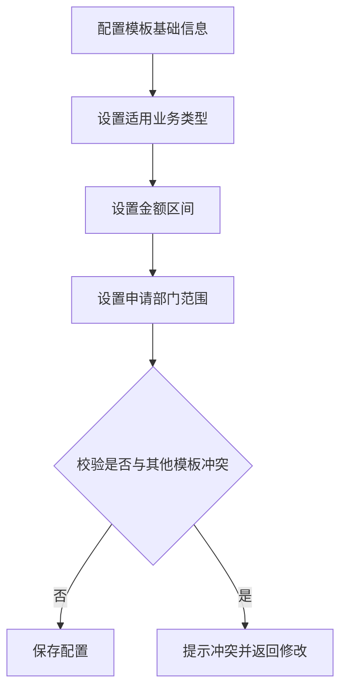
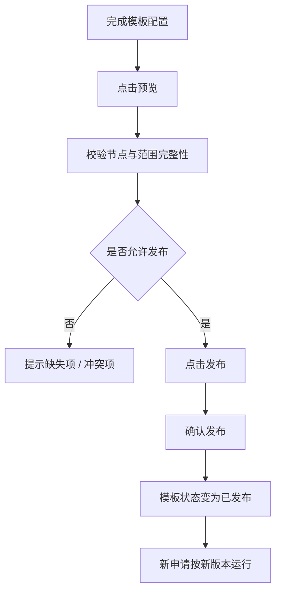

# 示例：审批流 / 配置流类 PRD（Few-shot 示例）

> 适用目的：作为 `prd-writer-b2b` Skill 的 few-shot 样例，用于约束审批流、配置流类需求的拆解方式、模块颗粒度与研发对齐表达。
>
> 需求类型：ToB / 中后台 / 流程配置能力 / 审批工作流设计

## 1. 版本信息

| 版本号 | 更新时间 | 作者 | 变更说明 | 状态 |
|---|---|---|---|---|
| V0.1 | 2026-04-02 | ChatGPT | 初稿创建，补齐审批流配置完整方案 | 草稿 |

---

## 2. 需求背景

### 2.1 需求来源
- 采购管理系统当前仅支持固定审批链路，由研发按业务规则写死。
- 随着客户组织规模扩大，不同采购类型、金额区间、申请部门的审批路径差异增多，固定审批逻辑已无法满足交付要求。
- 多个项目客户反馈，希望系统支持管理员自行配置审批流程，减少频繁提单开发带来的实施成本。

### 2.2 背景说明
当前采购申请流程为：
- 提交申请后自动进入“直属主管审批”
- 主管通过后进入“财务审批”
- 财务通过后结束

该模式适用于小规模、规则相对单一的组织，但在实际使用中出现以下问题：
1. 不同采购类型需要不同审批路径，例如办公采购、服务采购、设备采购的审批角色不同。
2. 大额采购需要加签分管领导或总经理，小额采购则无需进入高层审批。
3. 不同部门可能采用不同审批人来源规则，例如“部门负责人”“部门分管副总”“指定用户”。
4. 客户希望在不改代码的前提下，自行调整审批规则。

因此，需要建设一套后台可配置的审批流能力，使管理员可维护流程模板、节点规则、适用范围及启停状态。

### 2.3 当前问题

#### 问题一：审批逻辑写死，无法适配复杂业务
- 每新增一条审批规则都需要产品、研发重新评审与开发。
- 项目交付周期被审批规则变更反复拉长。

#### 问题二：缺少统一配置入口
- 客户管理员无法感知或维护现有审批链路。
- 同一类业务在不同环境下的实际流程不一致，难以排查问题。

#### 问题三：流程变更风险高
- 没有版本化配置和发布机制，容易出现“修改后直接影响线上申请”的风险。
- 审批链路变更后，历史流程与新流程的边界不清晰。

#### 问题四：系统扩展成本高
- 当前只有采购申请流程写死实现，后续若要扩展到报销、合同、用印等流程，会重复建设。

### 2.4 需求目标
1. 支持管理员配置审批流模板，而非依赖研发硬编码。
2. 支持基于业务类型、金额区间、申请部门等条件匹配不同审批模板。
3. 支持配置审批节点及审批人来源规则。
4. 支持模板预览、启停、发布，降低配置变更风险。
5. 为后续扩展到更多业务对象提供统一工作流配置基础。

### 2.5 非目标
- 本期不支持可视化拖拽编排器，仅采用表单化 / 结构化配置方式。
- 本期不支持并行网关、条件分支嵌套、多实例会签等复杂 BPMN 能力。
- 本期不支持审批时限、超时升级、催办策略等高级流程治理功能。
- 本期不支持跨系统外部审批节点。
- 本期不支持流程国际化、多语言配置。

### 2.6 简单调研 / 判断
结合常见 ToB 审批产品设计实践，本期更适合先抽象出“流程模板 + 适用条件 + 节点配置 + 发布机制”的基础闭环，而不是直接引入复杂流程引擎概念。

考虑到当前客户场景主要聚焦于：
- 单一路径的串行审批
- 根据规则选择模板
- 从组织 / 角色 / 指定人中确定审批人

因此本期建议优先支持“串行审批模板配置”，后续再评估是否需要升级到更复杂的流程建模能力。

### 2.7 简单实现思路
本期建议拆为四个核心模块：
1. 流程模板管理：创建、编辑、复制、启停、发布模板。
2. 节点配置：配置审批节点顺序、审批人来源、节点规则。
3. 适用范围配置：根据业务类型、金额区间、申请部门匹配模板。
4. 流程预览与生效机制：发布后新申请按新模板运行，已在途实例不受影响。

实现原则建议：
- 流程模板采用“草稿 / 已发布 / 已停用”状态管理。
- 模板发布后冻结历史版本，防止直接覆盖线上逻辑。
- 运行时先根据业务条件匹配模板，再展开节点生成审批实例。

---

## 3. Roadmap

### 3.1 功能模块拆分

| 模块 | 模块说明 | 优先级 | 原因 |
|---|---|---|---|
| 流程模板管理 | 维护审批模板的基础信息、状态及版本 | P0 | 基础能力，是后续所有配置的载体 |
| 审批节点配置 | 配置节点顺序、审批方式、审批人来源 | P0 | 决定流程能否运行，是主链路核心 |
| 适用范围配置 | 配置模板匹配条件，如业务类型、金额区间、部门 | P0 | 决定运行时选用哪套模板 |
| 流程预览与发布 | 支持查看完整链路并控制何时生效 | P0 | 降低上线风险，保障交付可控 |
| 模板复制与变更记录 | 支持快速复用模板、追踪修改记录 | P1 | 有助于运营维护，但不影响首期闭环 |
| 高级流程能力 | 如会签、并行、抄送、超时策略 | P2 | 复杂度高，非首期必要 |

### 3.2 迭代建议
- **P0：本期必须完成**
  - 流程模板管理
  - 审批节点配置
  - 适用范围配置
  - 流程预览与发布
- **P1：本期建议完成**
  - 模板复制
  - 变更记录
- **P2：后续可迭代能力**
  - 会签 / 或签
  - 并行分支
  - 超时 / 催办
  - 抄送 / 知会

### 3.3 模块依赖关系
- 节点配置依赖流程模板存在。
- 流程预览依赖节点配置与适用范围配置完成。
- 运行时审批实例生成依赖模板已发布。
- 若组织架构 / 角色体系尚未稳定，审批人来源配置将受限。

---

## 4. 需求详情

### 4.1 E-R 实体关系图（如适用）

本需求涉及流程模板、流程节点、适用范围规则、审批实例等核心实体，建议补充 E-R 图。

---

### 4.2 功能模块一：流程模板管理

#### 4.2.1 模块目标
让管理员可在后台建立和维护审批流模板，作为审批配置的基础载体。

#### 4.2.2 功能说明
1. **模板列表**
   - 展示全部审批模板。
   - 建议字段：模板名称、业务类型、状态、版本号、更新时间、创建人。

2. **新建模板**
   - 支持创建新模板。
   - 必填信息：模板名称、业务类型。

3. **编辑模板**
   - 草稿状态下支持编辑模板基础信息。
   - 已发布模板不可直接编辑，应通过“复制为新版本”方式修改。

4. **模板复制**
   - 支持基于已有模板复制生成新草稿。
   - 复制时保留节点与范围配置，便于快速调整。

5. **启停用模板**
   - 已停用模板不再参与新申请匹配。
   - 已在途审批实例不受影响。

#### 4.2.3 交互说明
- 入口：系统设置 > 审批流配置。
- 页面默认展示模板列表。
- 点击“新建模板”进入模板编辑页。
- 点击“复制”基于当前模板生成草稿副本。
- 已发布模板行操作中不展示“直接编辑”，仅展示“复制为新版本”。

#### 4.2.4 业务规则
- 模板名称在同一租户 + 业务类型维度下建议唯一。
- 一个模板在同一时间仅允许存在一个“草稿编辑版本”。
- 已发布模板不能直接覆盖，必须通过新版本发布替换。
- 停用模板后，不参与新实例匹配，但保留历史数据。

#### 4.2.5 边界与异常说明
- 未配置任何审批节点的模板不允许发布。
- 若模板适用范围与其他已发布模板完全冲突，发布时需提示冲突。
- 当用户无配置权限时，不展示新建 / 编辑 / 发布操作。

#### 4.2.6 流程原型图 / 流程说明

---

### 4.3 功能模块二：审批节点配置

#### 4.3.1 模块目标
让管理员可配置审批链路中的每个节点及审批人来源，形成可执行的审批顺序。

#### 4.3.2 功能说明
1. **节点新增 / 删除 / 排序**
   - 支持按顺序新增审批节点。
   - 支持删除未使用的草稿节点。
   - 支持调整节点顺序。

2. **节点属性配置**
   - 节点名称
   - 审批方式（单人审批 / 任一人审批，若本期允许）
   - 审批人来源类型
   - 审批人来源值

3. **审批人来源配置**
   - 支持以下来源：
     - 指定用户
     - 申请人直属主管
     - 申请部门负责人
     - 固定角色

4. **节点校验**
   - 每个节点必须至少能解析出一个审批人。
   - 节点顺序不可重复，不可跳号。

#### 4.3.3 交互说明
- 在模板编辑页中以“节点列表”形式展示。
- 每个节点以卡片或表单块形式配置。
- 提供“新增节点”按钮。
- 节点之间展示顺序编号，支持上移 / 下移。
- 节点审批人来源切换后，动态刷新可配置字段。

#### 4.3.4 业务规则
- 节点最少 1 个，最多建议限制为 20 个。
- 若审批人来源为“指定用户”，必须选择至少 1 名有效用户。
- 若审批人来源为“直属主管 / 部门负责人”，运行时需能从组织架构中解析。
- 若审批人来源无法解析，提交流程时需中断并给出错误提示。

#### 4.3.5 边界与异常说明
- 当组织架构未接入或缺少汇报关系时，不允许使用“直属主管”来源。
- 当指定角色下无有效成员时，流程提交时需报错并阻断。
- 当草稿模板被多人同时编辑时，需提示“配置已更新，请刷新后重试”。

#### 4.3.6 流程原型图 / 流程说明

---

### 4.4 功能模块三：适用范围配置

#### 4.4.1 模块目标
让系统在运行时能够根据业务条件自动匹配对应审批模板。

#### 4.4.2 功能说明
1. 支持配置模板适用业务类型。
2. 支持配置金额区间。
3. 支持配置申请部门范围。
4. 支持配置“全部适用 / 精确匹配 / 条件组合”三类基础范围。
5. 支持在模板列表中查看当前适用范围摘要。

#### 4.4.3 交互说明
- 模板编辑页中单独提供“适用范围”配置区。
- 金额区间建议采用区间输入框形式。
- 部门范围建议支持树状选择。
- 对范围冲突的模板，发布前统一校验并提示。

#### 4.4.4 业务规则
- 同一业务类型下，已发布模板的匹配范围不应完全重叠。
- 若存在多个模板同时命中，需有明确优先级规则；本期建议禁止完全重叠配置。
- 金额区间下限不得大于上限。

#### 4.4.5 边界与异常说明
- 未配置适用范围时，不允许发布。
- 当部门被删除或组织架构调整后，历史模板需提示存在失效配置。
- 金额为空时，仅表示不按金额条件限制，不表示 0。

#### 4.4.6 流程原型图 / 流程说明

---

### 4.5 功能模块四：流程预览与发布

#### 4.5.1 模块目标
让管理员在正式生效前预览完整审批链路，并通过发布机制控制模板上线时机。

#### 4.5.2 功能说明
1. **流程预览**
   - 展示节点顺序、审批人来源与适用范围摘要。
   - 支持在发布前进行总览检查。

2. **模板发布**
   - 草稿模板配置完整后可发布。
   - 发布后状态变为“已发布”。

3. **生效规则**
   - 新提交的审批申请按最新命中的已发布模板执行。
   - 已在途实例继续按启动时的模板版本运行。

#### 4.5.3 交互说明
- 模板编辑页右上角提供“预览”“保存草稿”“发布”按钮。
- 点击“预览”后，以流程视图展示节点链路。
- 点击“发布”前弹窗确认，显示本次将影响的新申请范围。

#### 4.5.4 业务规则
- 发布前必须完成基础信息、节点配置、适用范围三类必填项。
- 已发布模板若存在新版本，历史已发布版本自动变为“已替换”或“旧版本”。
- 在途实例不回溯切换模板版本。

#### 4.5.5 边界与异常说明
- 若发布时组织架构、角色数据校验失败，应阻止发布。
- 若当前模板引用的角色已停用，应提示并禁止发布。
- 若模板范围与线上模板冲突，应提示冲突模板名称与冲突原因。

#### 4.5.6 流程原型图 / 流程说明

---

## 5. 待确认项
- 当前系统是否已有统一组织架构、直属主管、部门负责人等基础数据来源。
- 不同业务类型是否需要共享同一套模板，还是完全独立配置。
- 模板冲突时是否允许优先级覆盖，还是强制禁止重叠。
- 后续是否需要支持会签、或签、抄送等高级节点类型。
- 是否需要在运行态保留“审批节点快照”，以防组织信息后续变化影响历史追溯。

---

## 写作风格提示（供 Skill 学习）
- 审批流 / 配置流类 PRD 要强调“模板、规则、版本、生效机制”，不能只写页面和按钮。
- 对配置类能力，必须写清“谁来配置、配什么、何时生效、如何校验、冲突怎么处理”。
- 对流程类需求，要尽量区分“配置态”和“运行态”。
- 对研发对齐型 PRD，要明确历史实例与新实例的关系，不要含糊写成“更新后生效”。
