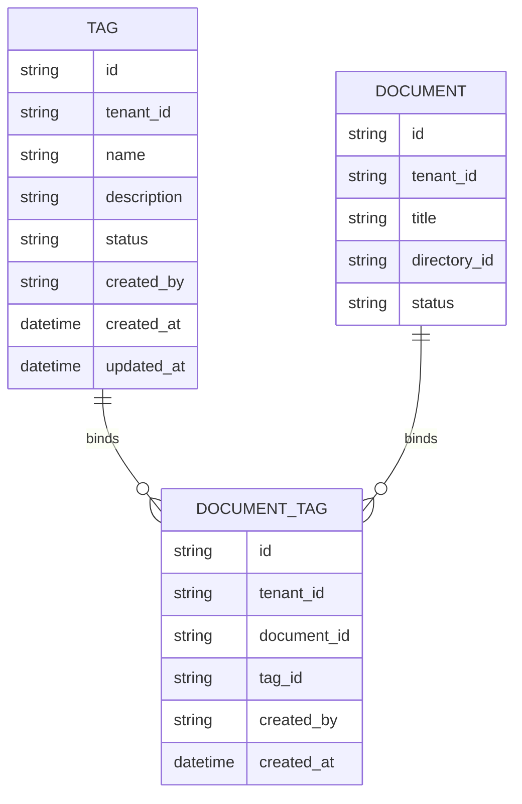
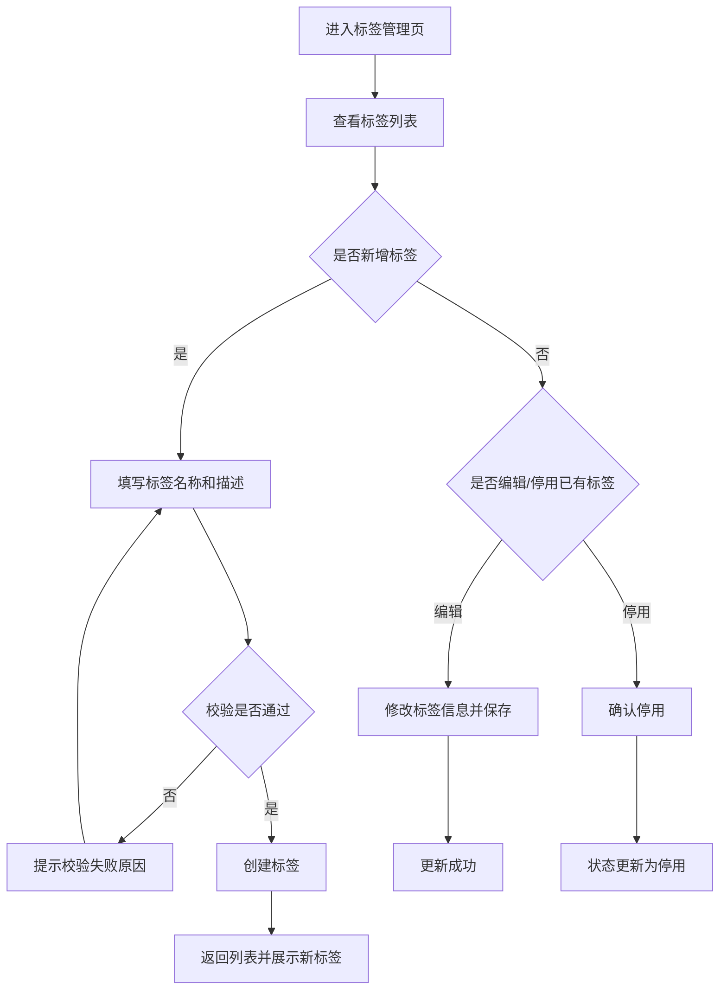
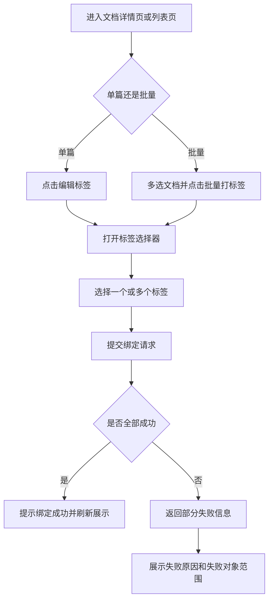
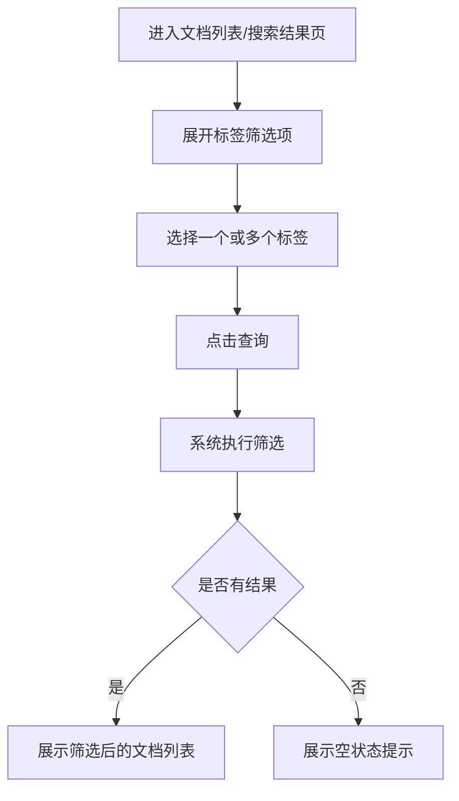

# 示例：知识库标签管理 PRD（Few-shot 示例）

> 适用目的：作为 `prd-writer-b2b` Skill 的 few-shot 样例，用于约束输出风格、文档颗粒度与研发对齐方式。
> 
> 需求类型：ToB / 中后台 / 配置化能力 / 知识治理模块

## 1. 版本信息

| 版本号 | 更新时间 | 作者 | 变更说明 | 状态 |
|---|---|---|---|---|
| V0.1 | 2026-04-02 | ChatGPT | 初稿创建，补齐标签管理完整方案 | 草稿 |

---

## 2. 需求背景

### 2.1 需求来源
- 某企业客户在知识库治理过程中提出，希望平台支持通过标签能力对知识文档进行多维度分类与筛选。
- 当前客户主要使用目录和搜索词管理文档，无法满足跨业务线、跨制度类型、跨适用范围的组合筛选需求。
- 需求由客户成功团队在项目交付过程中反馈，需纳入知识库后台能力建设规划。

### 2.2 背景说明
当前知识库后台已支持以下能力：
- 文档上传、编辑、删除
- 目录分类管理
- 基础关键词搜索
- 按创建时间、上传人等基础字段筛选

但在实际使用中，客户往往会从多个维度组织资料，例如：
- 工厂 / 厂区
- 文档类型（制度、SOP、应急预案、培训材料等）
- 适用对象（运维人员、管理人员、新员工等）
- 保密等级
- 业务归属

仅依赖目录结构会导致以下问题：
1. 一篇文档通常只属于一个目录，但可能同时具备多个业务属性。
2. 目录结构一旦承担过多分类职能，会逐渐变深、变复杂，维护成本高。
3. 管理员无法根据多个条件快速筛选文档，治理效率较低。
4. 后续若要扩展权限控制、精细化检索、专题推荐等能力，缺少统一的标签结构支撑。

因此，需要建设一套可配置、可管理、可绑定、可筛选的标签体系，作为知识库治理的基础能力之一。

### 2.3 当前问题
当前系统主要存在以下问题：

#### 问题一：知识分类维度单一
- 目录只能承载树状分类，不适合表达文档的多属性特征。
- 用户若希望按“某厂区 + 某文档类型 + 某业务线”筛选，当前系统无法直接支持。

#### 问题二：后台治理依赖人工约定
- 管理员主要依赖命名规范或目录命名习惯进行人工区分。
- 不同管理员理解不同，容易造成资料归档标准不统一。

#### 问题三：筛选能力不足
- 搜索结果通常只能依赖关键词命中，缺少结构化缩小范围能力。
- 当文档规模上升后，管理员定位目标文档的成本明显增加。

#### 问题四：扩展性不足
- 当前没有独立标签实体，后续若要支持标签统计、标签权限、标签策略推荐等能力，需要重复改造。

### 2.4 需求目标
本需求目标如下：

1. 建立独立的标签管理能力，使管理员可维护标签基础信息。
2. 支持将标签绑定到知识文档，形成“文档—标签”的多对多关系。
3. 支持在文档列表、搜索结果等场景中基于标签进行筛选。
4. 为后续知识治理能力扩展提供统一的数据结构基础。

### 2.5 非目标
本期不包含以下内容：
- 不支持标签层级树管理。
- 不支持标签组权限隔离。
- 不支持基于标签自动推荐文档。
- 不支持标签自动生成或 AI 自动打标。
- 不支持标签与外部业务系统字段自动同步。

### 2.6 简单调研 / 判断
结合现有知识库后台使用方式及常见 ToB 产品治理思路，标签能力一般会承担两个核心职责：
- 作为灵活分类工具，解决目录无法表达的多维属性问题。
- 作为结构化检索条件，服务后台治理和后续能力扩展。

因此本期更适合优先建设“基础标签体系”，而不是一次性引入复杂的标签分组、标签继承、自动化策略等高级能力。

### 2.7 简单实现思路
本期建议拆分为以下三个核心闭环：
1. 标签基础管理：支持创建、编辑、启用 / 停用标签。
2. 文档标签绑定：支持单篇和批量为文档绑定标签。
3. 标签筛选能力：支持在文档列表 / 搜索结果中通过标签筛选。

实现层面建议：
- 建立 `Tag` 实体与 `DocumentTag` 关联关系表。
- 标签在租户维度内唯一。
- 删除采用“停用替代物理删除”的方式，避免破坏历史数据。
- 标签筛选默认采用“多条件 AND，同一标签字段下 OR”的基础规则；如当前系统尚未抽象字段维度，则先支持简单多选标签筛选。

---

## 3. Roadmap

### 3.1 功能模块拆分

| 模块 | 模块说明 | 优先级 | 原因 |
|---|---|---|---|
| 标签管理 | 提供标签列表、新增、编辑、停用等后台管理能力 | P0 | 基础能力，其他模块的前置依赖 |
| 文档打标签 | 支持单篇文档和批量文档绑定标签 | P0 | 形成主流程闭环，决定标签体系是否可用 |
| 标签筛选 | 支持基于标签筛选文档列表和搜索结果 | P0 | 直接体现标签能力的业务价值 |
| 标签详情与使用统计 | 展示标签使用次数、最近使用情况 | P1 | 有助于治理优化，但不影响主链路闭环 |
| 标签扩展属性 | 支持颜色、描述增强、标签别名等属性 | P2 | 主要为体验增强，非本期必需 |

### 3.2 迭代建议
- **P0：本期必须完成**
  - 标签管理
  - 文档打标签
  - 标签筛选
- **P1：本期建议完成**
  - 标签使用次数统计
  - 标签详情页基础信息展示
- **P2：后续可迭代能力**
  - 标签层级
  - 标签分组
  - 标签自动推荐
  - 标签权限策略

### 3.3 模块依赖关系
- 标签管理是文档打标签、标签筛选的前置依赖。
- 若文档列表当前尚不支持批量操作，则“批量打标签”依赖文档列表批量能力。
- 若搜索结果页和文档列表页为两套不同实现，则标签筛选需分别接入。

---

## 4. 需求详情

### 4.1 E-R 实体关系图

本需求涉及标签实体、文档实体及中间绑定关系，建议补充 E-R 图，方便研发理解数据结构。

---

### 4.2 功能模块一：标签管理

#### 4.2.1 模块目标
让企业管理员可以在后台统一维护标签，为知识治理提供标准化分类维度。

#### 4.2.2 功能说明
本模块需支持以下能力：

1. **标签列表展示**
   - 展示当前租户下全部标签。
   - 列表字段建议包括：标签名称、描述、状态、使用次数、创建人、创建时间、最后更新时间。

2. **新增标签**
   - 管理员可创建新标签。
   - 创建时至少填写：标签名称。
   - 可选填写：标签描述。

3. **编辑标签**
   - 支持编辑标签名称、描述。
   - 不支持修改标签所属租户。

4. **启用 / 停用标签**
   - 启用后标签可被正常绑定使用。
   - 停用后标签不可用于新绑定，但保留历史绑定记录。

5. **搜索 / 筛选标签**
   - 支持按标签名称关键词搜索。
   - 支持按状态筛选。

#### 4.2.3 交互说明
- 入口：知识库后台新增一级或二级菜单“标签管理”。
- 标签管理页默认展示标签列表。
- 页面右上角提供“新增标签”按钮。
- 点击“新增标签”后，弹出创建表单。
- 标签列表中每一行提供“编辑”“停用/启用”操作。
- 对于已停用标签，在列表中明确展示状态标识，避免误用。

建议页面交互结构：
- 顶部：搜索区 + 状态筛选 + 新增按钮
- 中间：列表区
- 行操作：编辑 / 启停用

#### 4.2.4 业务规则
- 标签名称在**同一租户下唯一**。
- 标签名称长度建议限制为 1~30 个字符。
- 标签描述为非必填，长度建议不超过 200 个字符。
- 停用标签后：
  - 历史已绑定文档继续保留标签展示；
  - 新绑定时不再可选。
- 若标签已被文档使用，则不支持物理删除。

#### 4.2.5 边界与异常说明
- 当标签名称为空时，前端禁止提交并提示“请输入标签名称”。
- 当标签名称重复时，后端返回重名错误，前端提示“标签名称已存在”。
- 当标签已被使用时，删除操作不开放，统一仅允许停用。
- 当当前账号无标签管理权限时，不展示新增 / 编辑 / 状态变更操作。

#### 4.2.6 流程原型图 / 流程说明

---

### 4.3 功能模块二：文档打标签

#### 4.3.1 模块目标
让管理员能够将标签绑定到知识文档上，建立多维治理结构。

#### 4.3.2 功能说明
本模块需支持以下能力：

1. **单篇文档打标签**
   - 在文档详情页支持查看、添加、移除标签。

2. **批量文档打标签**
   - 在文档列表中支持多选后批量绑定标签。
   - 支持批量追加标签，不默认覆盖原有标签。

3. **查看文档已有标签**
   - 文档列表和详情页均应展示当前文档已绑定标签。

4. **移除标签**
   - 支持从单篇文档中移除指定标签。
   - 若为批量场景，可在后续迭代支持批量移除。

#### 4.3.3 交互说明
- 单篇场景：
  - 文档详情页增加“标签”区域。
  - 点击“编辑标签”后，弹出标签选择器。
- 批量场景：
  - 文档列表支持多选。
  - 工具栏提供“批量打标签”操作。
  - 弹窗中可多选标签，确认后执行绑定。

标签选择器建议交互：
- 支持搜索标签名称。
- 已停用标签默认不展示在可选列表中。
- 已绑定标签应有明显选中态。

#### 4.3.4 业务规则
- 单篇文档可绑定多个标签。
- 同一标签不可对同一文档重复绑定。
- 批量打标签默认采用“增量绑定”，即：
  - 已有标签不受影响；
  - 新选择的标签若文档尚未绑定，则新增绑定关系。
- 停用标签不可新绑定。

#### 4.3.5 边界与异常说明
- 若所选文档中包含当前账号无编辑权限的文档：
  - 不应整批失败；
  - 应返回成功 / 失败数量，并提示失败对象范围。
- 若所选标签已被停用：
  - 前端不可选；
  - 若并发情况下后端发现状态变更，应返回错误并提示“所选标签已停用，请刷新后重试”。
- 若批量操作文档数量过多，超过系统阈值，应提示分批处理。

#### 4.3.6 流程原型图 / 流程说明

---

### 4.4 功能模块三：标签筛选

#### 4.4.1 模块目标
让管理员能通过标签快速缩小文档范围，降低资料检索和治理成本。

#### 4.4.2 功能说明
本模块需支持以下能力：

1. **文档列表按标签筛选**
   - 在文档列表页增加标签筛选条件。

2. **搜索结果按标签筛选**
   - 在搜索结果页增加标签筛选条件。

3. **展示筛选结果**
   - 支持展示命中的文档列表。
   - 若当前筛选无结果，需给出空状态提示。

#### 4.4.3 交互说明
- 标签筛选区建议位于筛选栏中，与目录、创建时间、上传人等筛选条件并列。
- 标签选择支持多选。
- 已选择标签需以筛选项样式展示，支持一键清空。

建议本期先采用以下交互：
- 多选标签后，点击“查询”触发筛选。
- 暂不要求实时筛选，避免与现有页面刷新逻辑冲突。

#### 4.4.4 业务规则
- 若仅选择一个标签，则返回包含该标签的文档。
- 若选择多个标签，则默认采用 **AND 逻辑**，即返回同时绑定所有所选标签的文档。
- 仅支持对启用中标签作为筛选条件。
- 若历史文档绑定了已停用标签：
  - 是否允许用停用标签筛选，需要与业务确认；
  - 本期建议：后台仍可展示已停用标签对应的历史文档，但前端筛选项默认不展示停用标签。

#### 4.4.5 边界与异常说明
- 当选择标签组合后无结果时，应提示“当前筛选条件下暂无匹配文档”。
- 当标签数量较多时，筛选下拉需支持搜索。
- 若用户通过旧链接带入已停用标签条件，后端应兼容处理，不直接报错。

#### 4.4.6 流程原型图 / 流程说明

---

### 4.5 功能模块四：标签使用统计（P1）

#### 4.5.1 模块目标
帮助管理员识别高频标签和低频标签，为后续治理优化提供参考。

#### 4.5.2 功能说明
- 在标签列表中展示“使用次数”。
- 可在标签详情中展示当前关联文档数量。

#### 4.5.3 交互说明
- 标签列表增加“使用次数”列。
- 点击标签名称可进入标签详情页（若本期不做详情页，可暂缓）。

#### 4.5.4 业务规则
- 使用次数定义为当前与该标签绑定的文档数量。
- 统计口径默认实时读取或准实时更新，具体实现由研发评估。

#### 4.5.5 边界与异常说明
- 若系统存在归档 / 删除文档状态，需确认是否纳入统计口径。
- 若查询成本较高，可先异步统计，不作为本期阻塞项。

---

## 5. 待确认项
- 标签是否需要支持“标签分组”概念，例如“厂区类标签”“文档类型类标签”。
- 标签筛选多选逻辑是否统一采用 AND，是否存在部分业务想要 OR 的诉求。
- 批量打标签的单次数量上限是多少，是否需要后端异步任务支持。
- 历史已停用标签是否允许在后台筛选条件中继续展示。
- 是否需要开放标签详情页，而不仅仅是标签列表页。

---

## 6. 写作风格提示（供 Skill 学习）
本示例希望让 Skill 学到以下风格：
- 先讲清背景、问题和目标，再进入实现方案。
- Roadmap 按模块拆分，不按页面堆叠。
- 需求详情按“模块目标 → 功能说明 → 交互说明 → 业务规则 → 边界异常 → 流程说明”的顺序写。
- 对研发敏感的信息明确写出来，例如唯一性、停用逻辑、批量操作失败处理、状态兼容。
- 对暂不确定的信息统一放到“待确认项”，不硬编。
