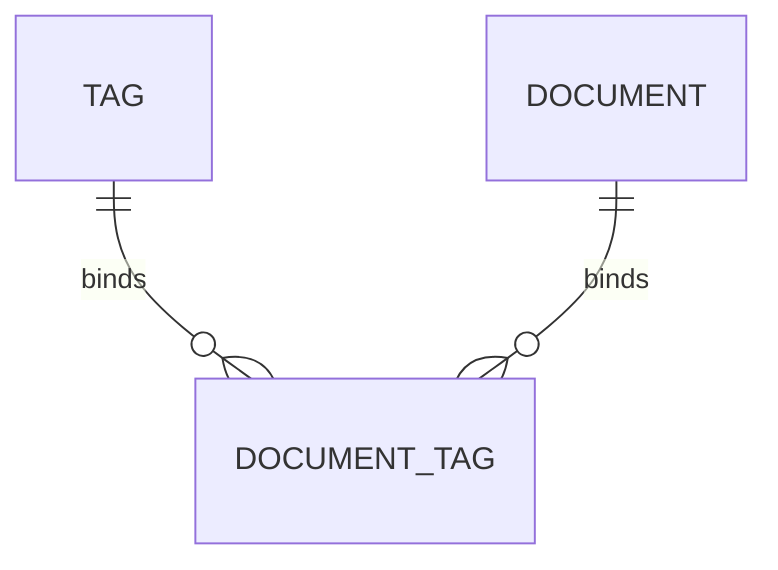

# 示例：知识库标签管理 PRD（节选）

## 1. 版本信息

| 版本号 | 更新时间 | 作者 | 变更说明 | 状态 |
|---|---|---|---|---|
| V0.1 | 2026-04-02 | ChatGPT | 初稿创建 | 草稿 |

## 2. 需求背景

### 2.1 需求来源
- 企业客户希望对知识文档进行多维度分类与检索，提升后台治理效率。

### 2.2 背景说明
- 当前知识文档仅支持基础目录管理，缺少灵活标签体系。
- 管理员难以按文档类型、业务线、适用范围等维度筛选资料。

### 2.3 当前问题
- 文档分类维度单一。
- 搜索结果难以进一步筛选。
- 知识治理依赖人工记忆与命名规范，维护成本高。

### 2.4 需求目标
- 建立可配置的标签管理能力。
- 支持管理员为知识文档打标签并基于标签筛选。
- 为后续权限、检索、推荐等能力提供可扩展结构。

### 2.5 简单实现思路
- 建立独立标签实体。
- 提供标签 CRUD、标签绑定、标签筛选能力。
- 后台以管理员为主要角色提供操作入口。

## 3. Roadmap

### 3.1 功能模块拆分
| 模块 | 模块说明 | 优先级 | 原因 |
|---|---|---|---|
| 标签管理 | 支持新增、编辑、停用标签 | P0 | 基础能力 |
| 文档打标签 | 支持对单篇或批量文档绑定标签 | P0 | 主链路闭环 |
| 标签筛选 | 支持按标签组合筛选文档 | P0 | 直接提升检索治理效率 |
| 标签统计 | 统计标签使用次数 | P1 | 增强运营能力 |

## 4. 需求详情

### 4.1 E-R 实体关系图

### 4.2 功能模块一：标签管理

#### 4.2.1 功能说明
- 管理员可新增标签。
- 管理员可编辑标签名称、描述、状态。
- 标签支持启用 / 停用。

#### 4.2.2 交互说明
- 在“标签管理”页面展示标签列表。
- 点击“新增标签”弹出创建表单。
- 编辑操作在列表行内触发或进入详情页触发。

#### 4.2.3 业务规则
- 标签名称在同一租户下唯一。
- 停用标签不可继续用于新绑定，但保留历史绑定关系。

#### 4.2.4 边界与异常说明
- 当标签名称重复时，前端提示并禁止提交。
- 当标签已被历史文档使用时，不允许物理删除，仅允许停用。

### 4.3 功能模块二：文档打标签

#### 4.3.1 功能说明
- 支持在文档详情页为单篇文档打标签。
- 支持在列表页批量为文档绑定标签。

#### 4.3.2 交互说明
- 文档详情页展示“标签”区域。
- 列表页支持多选文档后批量设置标签。

#### 4.3.3 业务规则
- 单篇文档可绑定多个标签。
- 已停用标签不可新绑定。

#### 4.3.4 边界与异常说明
- 若批量操作中部分文档无权限修改，需提示失败对象范围。

## 5. 待确认项
- 标签是否支持分组或层级结构。
- 是否需要标签颜色、别名等扩展属性。
