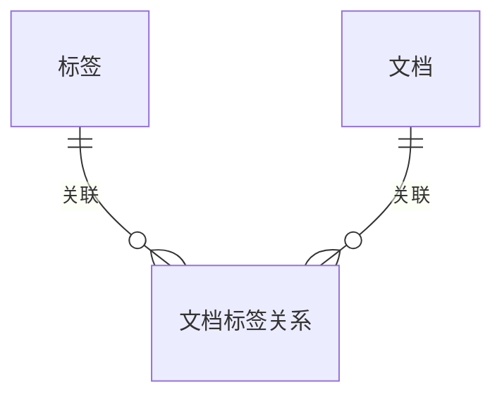
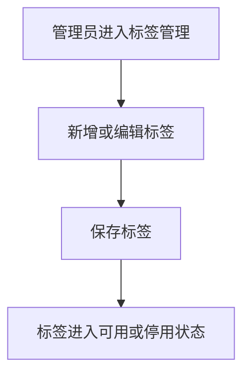

# 示例：知识库标签管理 PRD（Few-shot 示例）

> 适用目的：约束 `prd-writer-b2b` Skill 在对象治理类需求中的写法。
> 需求类型：ToB / 中后台 / 知识治理 / 标签管理

## 1. 版本信息

| 版本号 | 更新时间 | 作者 | 变更说明 | 状态 |
|---|---|---|---|---|
| V0.1 | 2026-04-02 | ChatGPT | 初稿创建，补齐标签管理方案 | 草稿 |

---

## 2. 需求背景

当前知识库后台已支持文档上传、目录分类和基础搜索，但企业管理员在日常治理中仍主要依赖目录层级和命名习惯区分资料。随着文档规模增大，这种方式越来越难支撑多维管理场景。例如一篇制度文件可能同时涉及厂区、文档类型、适用对象和业务归属，仅靠目录很难完整表达这些属性。

从实际使用看，管理员最常见的问题有两类：一类是不好管，缺少统一的分类口径；另一类是不好找，无法按多个业务维度组合筛选文档。继续把这些分类任务压到目录上，会让目录结构越来越深，也会提高后续维护成本。

因此，本期建议补一套基础标签能力，先完成“标签可管理、文档可绑定、列表可筛选”这三个闭环。这样既能改善当前治理效率，也能为后续权限控制、精细化检索和专题推荐等能力预留基础。

---

## 3. Roadmap

| 模块 | 模块说明 | 优先级 | 原因 |
|---|---|---|---|
| 标签管理 | 维护标签的新增、编辑、启停和查询 | P0 | 是整个标签体系的基础入口 |
| 文档打标签 | 支持单篇和批量绑定标签 | P0 | 决定标签是否真正可用 |
| 标签筛选 | 在文档列表和搜索结果中按标签筛选 | P0 | 直接体现业务价值 |
| 标签使用情况查看 | 查看标签被使用的次数和范围 | P1 | 有助于治理优化，但不影响首期闭环 |
| 标签扩展属性 | 如颜色、别名、分组等 | P2 | 主要为增强项 |

---

## 4. 需求详情

### 4.1 E-R 实体关系图（如适用）

本需求涉及“标签”“文档”“文档标签关系”三个核心业务对象，建议补充关系图，帮助团队统一理解。

---

### 4.2 功能模块一：标签管理

本模块面向企业管理员，目标是建立统一、可维护的标签口径。系统需要提供标签列表、新增、编辑、启用和停用能力，让管理员可以在一个固定入口完成标签维护。标签列表建议展示标签名称、状态、使用次数、更新时间等基础信息，方便管理员快速判断标签是否仍在使用。

在使用方式上，标签管理页建议提供搜索、状态筛选和新增入口。新增与编辑可采用弹窗或抽屉，不需要单独拉起复杂页面。停用后的标签不再用于新绑定，但历史已绑定文档仍保留原结果，避免因为停用动作影响历史资料展示。

关键规则建议控制在产品层可理解的粒度：同一租户下标签名称不重复；标签名称长度需要有基础限制；停用标签不再出现在新增绑定时的候选项中。对于“历史已绑定文档是否允许继续展示停用标签”，本期建议保留展示，避免治理口径前后不一致。

#### 流程说明（如需要）

---

### 4.3 功能模块二：文档打标签

本模块目标是让标签真正落到文档治理流程中。系统需要支持管理员在单篇文档详情中配置标签，也支持在文档列表中对多篇文档批量绑定标签。这样既能覆盖精细调整场景，也能兼顾存量资料治理。

在交互上，单篇配置建议放在文档详情页或编辑页内，批量配置建议复用现有列表批量操作能力。管理员选择标签后，系统应展示已绑定结果，并允许在同一入口继续补充或移除。若当前文档列表尚未具备批量操作能力，应在待确认项中明确该能力是否属于本期前置依赖。

本模块的关键规则包括：单篇文档可绑定多个标签；同一文档下同一标签不重复绑定；已停用标签不能再新增绑定，但历史绑定关系默认保留。若文档状态对编辑有限制，例如已归档文档不可再编辑，也需要沿用现有规则。

---

### 4.4 功能模块三：标签筛选

本模块目标是让管理员能够基于标签快速缩小文档范围。系统需要在文档列表和搜索结果中提供标签筛选入口，支持按照一个或多个标签查看命中文档。标签筛选不应替代搜索，而应作为结构化缩小范围的补充能力。

在交互上，筛选入口建议与现有目录、状态、上传人等条件保持同层级，避免用户切换多个区域操作。若当前系统已有统一筛选区，则直接纳入即可。筛选结果需明确展示当前已生效的标签条件，方便管理员回看与清除。

本期建议先采用简单直观的多选筛选规则，并在页面说明中保持口径一致。若业务后续希望区分“同类标签”和“跨类标签”的组合逻辑，可作为后续增强项处理。

---

## 5. 待确认项
- 文档列表当前是否已具备批量操作能力，待确认。
- 标签是否需要区分业务维度或标签分组，待确认。
- 停用标签在历史筛选条件中是否仍可被搜索到，待确认。
