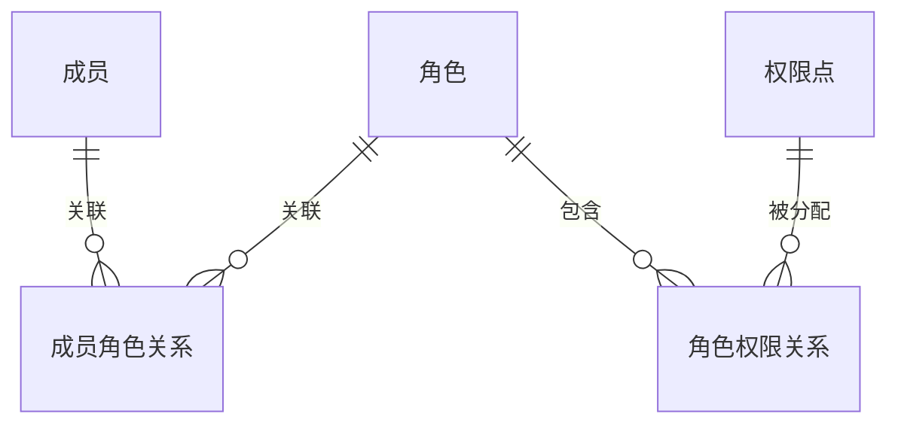
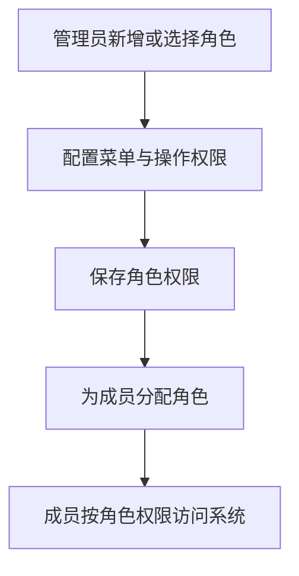

# 示例：权限管理 / 角色管理类 PRD（Few-shot 示例）

> 适用目的：约束 `prd-writer-b2b` Skill 在权限体系类需求中的写法。
> 需求类型：ToB / 中后台 / 权限体系 / 角色管理

## 1. 版本信息

| 版本号 | 更新时间 | 作者 | 变更说明 | 状态 |
|---|---|---|---|---|
| V0.1 | 2026-04-02 | ChatGPT | 初稿创建，补齐角色权限管理方案 | 草稿 |

---

## 2. 需求背景

当前系统只有较粗的权限区分方式，无法满足企业客户按岗位分工管理的实际诉求。随着后台模块越来越多，继续依赖少数高权限账号处理配置、审核和治理工作，既容易带来权限过大问题，也会增加交付和运维压力。

从客户实际场景看，不同岗位对系统的访问边界差异非常明显。例如运营人员需要查看和编辑部分业务内容，但不应接触关键配置；审核人员需要处理审批事项，但不应修改系统策略；知识管理员可以维护知识库，却不一定需要组织管理权限。若系统缺少角色化授权能力，这些场景都会退化为人工协调或临时放权。

因此，本期建议先建设一套基础角色权限能力，完成“角色可管理、权限可配置、成员可分配、系统能按权限生效”这四个闭环。首期先解决菜单和操作权限，不一次性扩展到复杂数据权限。

---

## 3. Roadmap

| 模块 | 模块说明 | 优先级 | 原因 |
|---|---|---|---|
| 角色管理 | 维护角色名称、说明和状态 | P0 | 是角色化授权的基础入口 |
| 权限配置 | 为角色勾选菜单和操作权限 | P0 | 决定系统能否按岗位区分能力 |
| 成员角色分配 | 为成员分配角色并查看已有授权 | P0 | 形成权限闭环 |
| 权限生效接入 | 让系统真正按角色权限展示和限制操作 | P0 | 没有生效接入，前面配置无法落地 |
| 数据权限扩展位 | 为后续部门、组织范围控制预留位置 | P1 | 未来可能高频，但非首期必需 |
| 临时授权等高级能力 | 如临时扩权、到期回收 | P2 | 复杂度较高，后续再评估 |

---

## 4. 需求详情

### 4.1 E-R 实体关系图（如适用）

本需求涉及“成员”“角色”“权限点”“成员角色关系”等业务对象，建议补充关系图帮助统一理解。

---

### 4.2 功能模块一：角色管理

本模块面向企业管理员，目标是让不同岗位拥有清晰、可维护的角色定义。系统需要支持角色列表、新增、编辑、复制和停用，使管理员可以围绕岗位职责建立角色，而不是围绕具体成员反复配置权限。

在使用方式上，角色列表建议展示角色名称、角色说明、状态、成员数和更新时间。新增角色时，先录入基础信息，再进入权限配置。系统内置角色应与自定义角色有明显区分，避免管理员误操作关键角色。

本模块的关键规则包括：同一租户下角色名称不重复；超级管理员等系统内置角色不可删除，也不建议随意停用；停用角色后，不再允许继续分配给新成员，但历史已绑定关系可保留，用于后续治理和排查。

---

### 4.3 功能模块二：权限配置

本模块目标是让管理员可以按角色而不是按成员逐个分配能力。系统需要支持按模块、菜单和操作维度勾选权限，使角色具备明确边界。首期建议由系统预置权限点，管理员只做分配，不自行创建复杂权限对象。

在交互上，权限配置建议采用树形或分组展示，让管理员能从业务模块视角理解自己在配什么，而不是面对一串难以理解的技术标识。对于关键操作权限，例如删除、发布、停用等，建议有更明确的提示，帮助管理员理解风险差异。

本模块的关键规则包括：用户最终权限可按其拥有角色进行合并计算；若某些权限依赖上层菜单或模块可见性，应在配置界面中给出基础联动提示；前台展示限制和实际操作限制都需要保持一致，避免“看得见但不能做”或“看不见却能调用”的混乱体验。

#### 流程说明（如需要）

---

### 4.4 功能模块三：成员角色分配与权限生效

本模块目标是让角色配置真正落实到成员使用中。系统需要支持管理员在成员管理场景中为用户分配一个或多个角色，并在成员详情中查看当前已生效的角色结果。这样可以减少逐人配置带来的重复劳动，也方便后续排查权限问题。

在使用方式上，角色分配建议放在成员详情或批量管理入口中完成。角色变更后，系统应有明确的生效口径，例如重新登录后生效或下一次鉴权时生效，避免管理员对权限何时变化产生误解。

本模块的关键规则包括：已停用角色不可再分配给新成员；角色调整后应能被管理员回看；系统需要在关键页面和关键操作上真正按权限结果进行展示和限制。对于后续可能增加的数据权限，本期建议只预留位置，不在本轮展开复杂配置。

---

## 5. 待确认项
- 当前系统的权限点清单是否已整理完整，待确认。
- 角色调整后的生效时点采用重新登录还是实时鉴权，待确认。
- 后续数据权限是按部门、组织还是业务对象范围控制，待确认。
