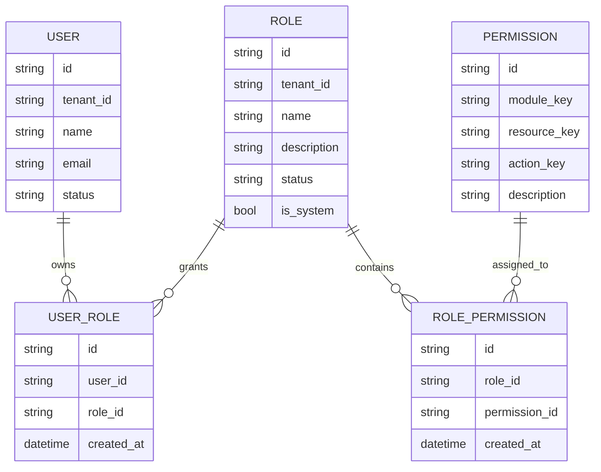
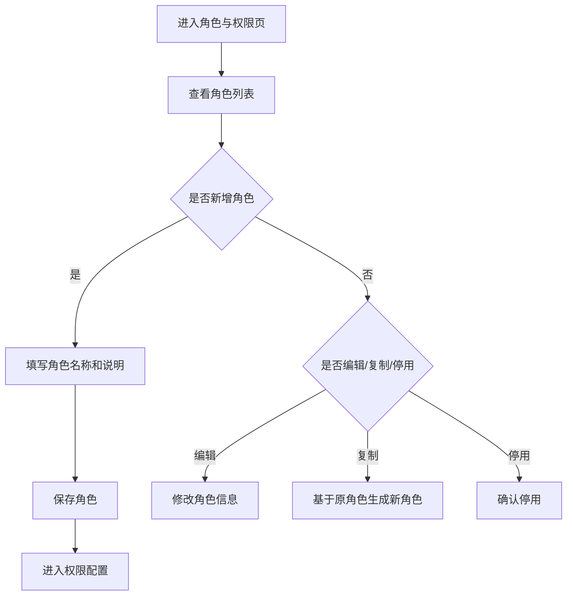
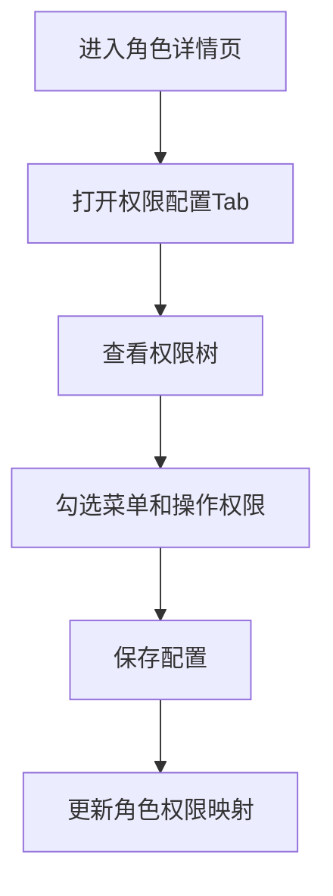
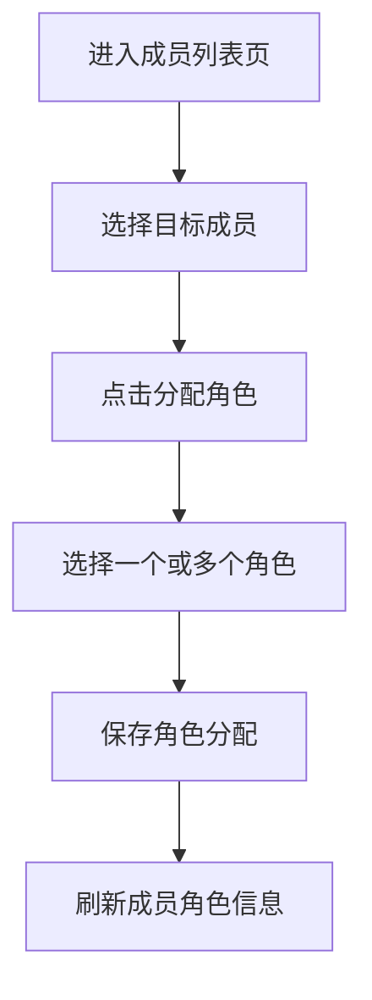
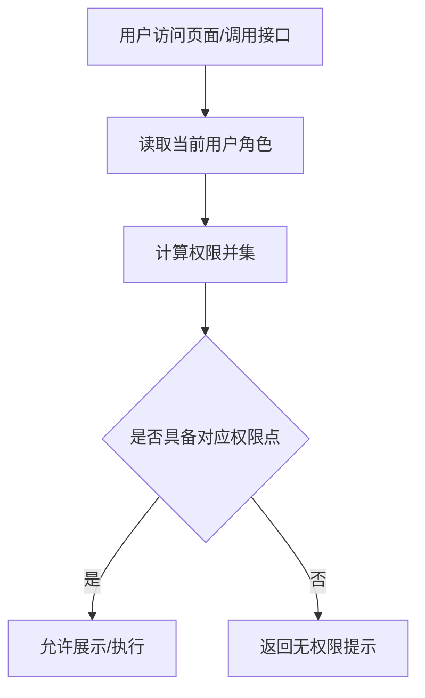

# 示例：权限管理 / 角色管理类 PRD（Few-shot 示例）

> 适用目的：作为 `prd-writer-b2b` Skill 的 few-shot 样例，用于约束权限体系、角色管理类需求的文档结构、规则表达与研发对齐方式。
>
> 需求类型：ToB / 中后台 / 权限体系 / 角色管理模块

## 1. 版本信息

| 版本号 | 更新时间 | 作者 | 变更说明 | 状态 |
|---|---|---|---|---|
| V0.1 | 2026-04-02 | ChatGPT | 初稿创建，补齐角色权限管理完整方案 | 草稿 |

---

## 2. 需求背景

### 2.1 需求来源
- 当前系统后台仅有“超级管理员 / 普通用户”两类粗粒度权限控制，无法满足企业客户精细化分工管理要求。
- 多个客户在项目交付中提出，希望可以按岗位职责配置菜单权限、操作权限，并由管理员为成员分配角色。
- 随着系统功能增加，单一超管模式带来权限滥用和运维风险，角色化权限管理已成为平台基础能力缺口。

### 2.2 背景说明
当前系统存在以下现状：
- 超级管理员拥有全部菜单与操作权限。
- 普通用户只能访问默认授权范围，无法灵活配置。
- 新成员接入时只能由研发或运维手动调整权限。
- 不同岗位，例如运营、审核员、知识管理员、部门负责人，所需权限边界明显不同。

在企业交付中，常见诉求包括：
1. 运营人员可查看和编辑部分业务数据，但不可删除关键数据。
2. 审核人员可进行审批操作，但不可修改系统配置。
3. 知识管理员可管理知识库，但不可访问组织架构配置。
4. 部门负责人仅能查看本部门数据。

因此，需要建立一套基础 RBAC（Role-Based Access Control）能力，支持角色配置、权限点授权、成员角色分配，并为后续数据权限扩展预留接口。

### 2.3 当前问题

#### 问题一：权限模型粗糙
- 仅靠“超级管理员 / 普通用户”无法支撑实际岗位分工。
- 一旦授予超管权限，风险范围过大。

#### 问题二：权限分配成本高
- 成员权限调整依赖研发或运维介入。
- 项目交付阶段重复性人工配置较多。

#### 问题三：权限边界不透明
- 用户无法清楚知道某个角色具体拥有哪些菜单和操作权限。
- 排查“为什么看不到 / 为什么不能操作”成本较高。

#### 问题四：后续扩展困难
- 若未来引入数据权限、租户级隔离、子管理员体系，缺少统一权限底座。

### 2.4 需求目标
1. 支持管理员创建、编辑、停用角色。
2. 支持按菜单、页面操作维度为角色配置权限点。
3. 支持为成员分配一个或多个角色。
4. 支持在前端与后端同时按权限进行控制。
5. 为后续数据权限扩展预留结构化入口。

### 2.5 非目标
- 本期不支持复杂 ABAC（属性权限）模型。
- 本期不支持跨租户角色共享。
- 本期不支持字段级权限控制。
- 本期不支持完整的数据权限规则编排，仅预留能力位。
- 本期不支持审批授权、临时授权等高级场景。

### 2.6 简单调研 / 判断
对于大多数 ToB 中后台场景，首期更适合采用标准 RBAC 模型：
- 权限点（Permission）定义系统能做什么。
- 角色（Role）定义一组权限组合。
- 用户（User）通过分配角色继承权限。

相比一开始就做复杂的数据权限引擎，先把菜单、页面操作、角色分配三件事做清楚，更利于控制系统复杂度和交付节奏。

### 2.7 简单实现思路
本期建议拆为四个核心模块：
1. 角色管理：角色列表、新增、编辑、停用。
2. 权限配置：按模块 / 菜单 / 操作点为角色勾选权限。
3. 成员角色分配：为用户分配一个或多个角色。
4. 权限校验与展示控制：前端控制可见性，后端控制可执行性。

实现原则建议：
- 权限点由系统预置，避免管理员任意创建导致逻辑失控。
- 角色支持多选分配，用户最终权限取并集。
- 超级管理员角色默认存在且不可删除。
- 数据权限先预留扩展字段，不在本期深入实现。

---

## 3. Roadmap

### 3.1 功能模块拆分

| 模块 | 模块说明 | 优先级 | 原因 |
|---|---|---|---|
| 角色管理 | 管理角色基础信息、状态与说明 | P0 | 权限体系入口，是角色化授权基础 |
| 权限配置 | 为角色配置菜单权限和操作权限 | P0 | 决定系统实际授权能力 |
| 成员角色分配 | 将角色分配给成员并查看已有授权情况 | P0 | 形成授权闭环 |
| 权限校验接入 | 前后端接入统一权限判断 | P0 | 没有接入即无法真正生效 |
| 数据权限扩展位 | 预留按组织 / 部门 / 数据范围控制入口 | P1 | 未来高频需求，但首期非必需 |
| 临时授权 / 授权审批 | 临时扩权、到期回收 | P2 | 复杂度高，后续再评估 |

### 3.2 迭代建议
- **P0：本期必须完成**
  - 角色管理
  - 权限配置
  - 成员角色分配
  - 权限校验接入
- **P1：本期建议完成**
  - 数据权限配置占位
  - 角色复制
- **P2：后续可迭代能力**
  - 临时授权
  - 授权审批
  - 字段级权限

### 3.3 模块依赖关系
- 权限配置依赖系统已有权限点清单。
- 成员角色分配依赖角色管理模块存在。
- 权限生效依赖前端路由、按钮、接口层均接入校验。
- 若组织架构尚未稳定，数据权限扩展会受限。

---

## 4. 需求详情

### 4.1 E-R 实体关系图（如适用）

本需求涉及用户、角色、权限点及其关联关系，建议补充 E-R 图。

---

### 4.2 功能模块一：角色管理

#### 4.2.1 模块目标
让管理员能够建立不同岗位角色，并维护角色的名称、说明和启停状态。

#### 4.2.2 功能说明
1. **角色列表**
   - 展示当前租户下全部角色。
   - 字段建议包括：角色名称、角色说明、角色类型、状态、成员数、更新时间。

2. **新增角色**
   - 支持创建自定义角色。
   - 必填：角色名称。
   - 可选：角色说明。

3. **编辑角色**
   - 支持修改角色名称、说明。
   - 系统内置角色的名称与关键属性不可随意修改。

4. **停用角色**
   - 停用后该角色不可再分配给新成员。
   - 已绑定成员的历史关系保留，但需提示该角色已停用。

5. **复制角色**
   - 基于现有角色复制一份新的角色配置，便于快速搭建相近岗位权限。

#### 4.2.3 交互说明
- 入口：系统设置 > 角色与权限。
- 默认展示角色列表。
- 提供“新增角色”按钮。
- 每条角色支持“编辑”“复制”“停用”。
- 点击角色名称可进入详情页查看权限配置和成员列表。

#### 4.2.4 业务规则
- 角色名称在同一租户下唯一。
- 系统预置的“超级管理员”角色不可删除，不可停用。
- 停用角色不影响已登录用户当前会话，重新鉴权后按最新状态生效。
- 一个租户下角色数建议设置上限，避免无序膨胀。

#### 4.2.5 边界与异常说明
- 当角色名称重复时，保存失败并提示“角色名称已存在”。
- 当角色下仍有成员绑定时，不允许物理删除，仅允许停用。
- 当当前用户无角色管理权限时，不展示新增 / 编辑 / 停用操作。

#### 4.2.6 流程原型图 / 流程说明

---

### 4.3 功能模块二：权限配置

#### 4.3.1 模块目标
让管理员能够为角色勾选菜单与操作权限，形成清晰可维护的授权集合。

#### 4.3.2 功能说明
1. **权限点展示**
   - 按系统模块、页面、操作维度展示权限点。
   - 例如：知识库模块 > 文档列表页 > 查看 / 新增 / 编辑 / 删除。

2. **权限勾选**
   - 管理员可为角色勾选对应权限点。
   - 支持父子节点联动勾选。

3. **权限回显**
   - 角色详情页需展示当前已授权限。

4. **权限变更保存**
   - 保存后对该角色下成员在下次鉴权时生效。

#### 4.3.3 交互说明
- 角色详情页分为“基础信息”“权限配置”“成员列表”三个 Tab。
- 权限配置区域建议采用树状结构或模块折叠面板。
- 勾选菜单时，可联动展示对应按钮 / 操作权限。
- 保存前显示“本次新增 / 移除权限数”。

#### 4.3.4 业务规则
- 权限点由系统预置，管理员不可自定义创建。
- 用户最终权限 = 所有已分配角色权限点的并集。
- 若父级菜单无查看权限，则其下操作权限默认不生效。
- 超级管理员角色默认拥有全部权限点。

#### 4.3.5 边界与异常说明
- 当系统新增功能模块但权限点未同步初始化时，应默认仅超级管理员可见。
- 当角色被停用时，不允许继续编辑权限配置。
- 当保存权限时发生并发更新，应提示“权限已被其他管理员修改，请刷新后重试”。

#### 4.3.6 流程原型图 / 流程说明

---

### 4.4 功能模块三：成员角色分配

#### 4.4.1 模块目标
让管理员能够为系统成员分配适合的角色，完成角色授权闭环。

#### 4.4.2 功能说明
1. **成员列表查看**
   - 在成员管理页查看用户当前角色。

2. **分配角色**
   - 支持为成员分配一个或多个角色。
   - 支持移除已有角色。

3. **角色回显**
   - 在成员详情页清晰展示当前绑定角色清单。

4. **批量分配（可选）**
   - 若成员管理已有批量操作能力，可支持批量绑定同一角色。

#### 4.4.3 交互说明
- 在成员列表页提供“分配角色”操作。
- 点击后弹出角色选择弹窗，支持多选。
- 角色选项中需标明是否为停用角色。
- 已停用角色默认不可新选，但可展示历史绑定信息。

#### 4.4.4 业务规则
- 一个成员可绑定多个角色。
- 若成员被移除全部角色，则仅保留系统默认最低权限。
- 停用角色不应继续被分配。
- 删除角色时如仍有成员绑定，必须先解除绑定或改为停用。

#### 4.4.5 边界与异常说明
- 当成员账号状态为停用时，不允许继续进行角色分配。
- 当目标角色为系统保护角色且当前操作者无足够权限时，不允许分配。
- 当批量分配成员数过大时，需限制单次处理数量或采用异步执行。

#### 4.4.6 流程原型图 / 流程说明

---

### 4.5 功能模块四：权限校验接入

#### 4.5.1 模块目标
确保角色权限不只停留在配置层，而是真正在页面展示和接口执行层生效。

#### 4.5.2 功能说明
1. **前端展示控制**
   - 无菜单权限时，不展示对应导航入口。
   - 无操作权限时，不展示或置灰对应按钮。

2. **后端接口校验**
   - 所有关键接口需校验权限点。
   - 禁止仅依赖前端控制。

3. **鉴权缓存机制**
   - 用户登录后可缓存权限快照。
   - 当角色权限变更后，需在下次登录或刷新鉴权时生效。

4. **无权限提示**
   - 页面级无权限时，展示无权限状态页。
   - 接口级无权限时，返回统一错误码与提示。

#### 4.5.3 交互说明
- 页面访问无权限时，应跳转或展示统一提示，而非空白页。
- 按钮无权限时，优先不展示；若业务上需要可见不可点，则需明确提示原因。

#### 4.5.4 业务规则
- 权限必须以前后端双重校验为准。
- 用户最终权限由角色并集计算得出。
- 菜单可见不等于接口可执行，仍需操作权限单独校验。
- 权限变更后不强制踢出在线用户，但下次鉴权需更新。

#### 4.5.5 边界与异常说明
- 当用户通过旧链接访问无权限页面时，应返回无权限提示，而非 404。
- 当前端本地权限缓存与服务端不一致时，以服务端为准。
- 对高风险操作（如删除、导出敏感数据）建议增加单独审计日志。

#### 4.5.6 流程原型图 / 流程说明

---

## 5. 待确认项
- 本期是否需要支持数据权限，如“仅查看本部门数据 / 仅查看本人创建数据”。
- 当前系统是否已有完整权限点清单，还是需要同步梳理。
- 用户角色变更后，是否要求强制实时生效，还是允许登录态周期内延迟生效。
- 是否需要记录角色与权限变更审计日志。
- 是否允许业务管理员创建子管理员角色，并限制其只能分配部分角色。

---

## 写作风格提示（供 Skill 学习）
- 权限管理类 PRD 不能只写“页面可见性”，必须同时写前后端校验。
- 角色、权限点、成员分配三层关系要拆清楚，避免混写。
- 对权限需求，要尽量写清“配置态”和“生效态”，以及变更后的影响范围。
- 对 ToB 系统，权限设计要显式说明系统保护角色、停用策略、并集规则与高风险操作边界。
