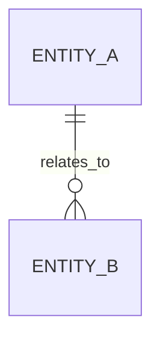
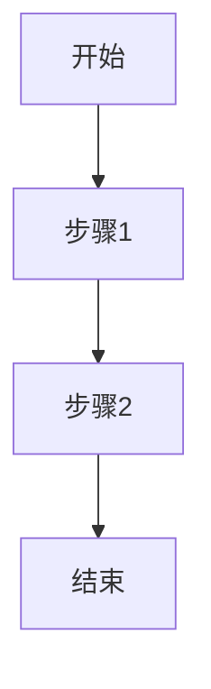

# PRD 模板

## 1. 版本信息

| 版本号 | 更新时间 | 作者 | 变更说明 | 状态 |
|---|---|---|---|---|
| V0.1 | YYYY-MM-DD | 待补充 | 初稿创建 | 草稿 |

---

## 2. 需求背景

### 2.1 需求来源
- 

### 2.2 背景说明
- 

### 2.3 当前问题
- 

### 2.4 需求目标
- 

### 2.5 简单调研 / 判断（如有）
- 

### 2.6 简单实现思路
- 

---

## 3. Roadmap

### 3.1 功能模块拆分
| 模块 | 模块说明 | 优先级 | 原因 |
|---|---|---|---|
| 模块A |  | P0 |  |
| 模块B |  | P1 |  |
| 模块C |  | P2 |  |

### 3.2 迭代建议
- P0：本期必须完成的核心闭环
- P1：本期建议完成的增强项
- P2：后续可迭代能力

---

## 4. 需求详情

### 4.1 E-R 实体关系图（如适用）
> 若存在清晰业务实体关系，则补充；否则写“本需求暂不涉及复杂实体关系图”。

---

### 4.2 功能模块一：模块名称

#### 4.2.1 功能说明
- 

#### 4.2.2 交互说明
- 

#### 4.2.3 业务规则
- 

#### 4.2.4 边界与异常说明
- 

#### 4.2.5 流程原型图 / 流程说明

---

### 4.3 功能模块二：模块名称

#### 4.3.1 功能说明
- 

#### 4.3.2 交互说明
- 

#### 4.3.3 业务规则
- 

#### 4.3.4 边界与异常说明
- 

#### 4.3.5 流程原型图 / 流程说明

---

## 5. 待确认项
- 
