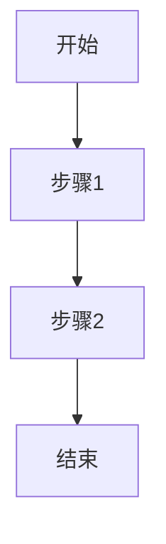

# PRD 模板

## 1. 版本信息

| 版本号 | 更新时间 | 作者 | 变更说明 | 状态 |
|---|---|---|---|---|
| V0.1 | YYYY-MM-DD | 待补充 | 初稿创建 | 草稿 |

---

## 2. 需求背景

在本节下，用 2~4 段连续内容说明以下信息即可，不必强制拆成很多二级或三级标题：
- 需求从哪里来
- 当前业务中存在什么问题
- 为什么现在要做
- 希望达成什么结果
- 对方案方向的简单判断

可参考写法：

> 当前系统已支持 X、Y、Z 能力，但在实际使用中，A 角色在处理 B 场景时仍存在 C 问题，主要表现为……
> 随着……变化，原有方式已难以支撑……，因此本期需要补充……能力。
> 结合当前业务阶段，本期建议先完成……闭环，而不一次性扩展到……。

---

## 3. Roadmap

| 模块 | 模块说明 | 优先级 | 原因 |
|---|---|---|---|
| 模块A |  | P0 |  |
| 模块B |  | P1 |  |
| 模块C |  | P2 |  |

补充说明：
- P0：本期必须完成的核心闭环
- P1：本期建议完成的增强项
- P2：后续可迭代能力

---

## 4. 需求详情

### 4.1 E-R 实体关系图（如适用）

仅在以下情况补充：
- 存在多个核心业务实体
- 实体关系对理解需求有明显帮助
- 用户或团队有明确需要

建议优先使用业务实体中文命名。若无必要，可直接写：本需求暂不涉及复杂实体关系图。

---

### 4.2 功能模块一：模块名称

本模块建议以连贯内容为主，必要时再补少量小标题。默认可覆盖以下内容：
- 模块目标
- 功能设计
- 使用方式 / 交互方式
- 规则与边界
- 例外场景

可参考写法：

本模块面向____角色，目标是____。系统需要支持____，使用户能够在____场景下完成____。在交互上，建议____。当出现____情况时，系统应____。本期不处理____场景，相关情况先收敛到待确认项或后续迭代。

#### 流程说明（如需要）

---

### 4.3 功能模块二：模块名称

本模块面向____角色，目标是____。系统需要支持____，使用户能够在____场景下完成____。在交互上，建议____。当出现____情况时，系统应____。本期不处理____场景，相关情况先收敛到待确认项或后续迭代。

#### 流程说明（如需要）

---

## 5. 待确认项
- 
